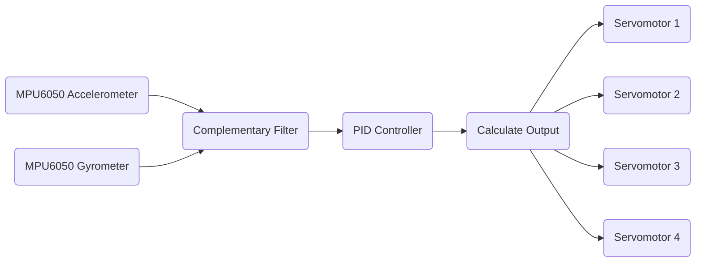

# eChanomi - a self-balancing plate

The self-balancing plate from [the CPS course](https://campus.tum.de/tumonline/ee/ui/ca2/app/desktop/#/pl/ui/$ctx/WBMODHB.wbShowMHBReadOnly?$ctx=design=ca2;header=max;lang=en&pKnotenNr=3038801&pOrgNr=1) at TUM.
Chanomi comes from "茶飲み" in Japanese, which means "drinking tea".
The objective was to make a self-balancing plate with a teacup on it to carry it without spilling.
However, I would say the balancing functionality itself is not that quick from the problems.
There is a lot of space to improve this project, but I leave the work as of now here.

The original inspiration comes from the old Japanese mechanical doll called ["茶運び人形" (Chahakobi-Ningyo)](https://ja.wikipedia.org/wiki/%E8%8C%B6%E9%81%8B%E3%81%B3%E4%BA%BA%E5%BD%A2).

## Work

## How It works

## Materials

- Raspberry Pi 3B
- MPU6050 (Accelerometer and Gyrometer)
- [Servomotors x 4](https://amzn.eu/d/0OTdLRw) - Better to use something more accurate
- [16-Channel PWM Hat](https://amzn.eu/d/6rtuQci)
- [Universal Joint](https://amzn.eu/d/5azXKrS)
- 3D Printer

## Problems

### Servomotors are not accurate enough
This makes it difficult to stabilise the plate at the zero position.
As a result, the parameters of PID are set to very low so that it does not oscillate.

### The parts are not solid enough
Since every part is made by the 3D printer, those are not solid enough for some parts.
Especially the connection between the servomotor and the arms is not solid, and it makes a lot of errors.
